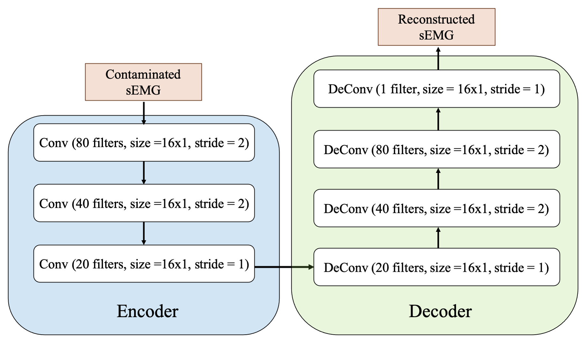
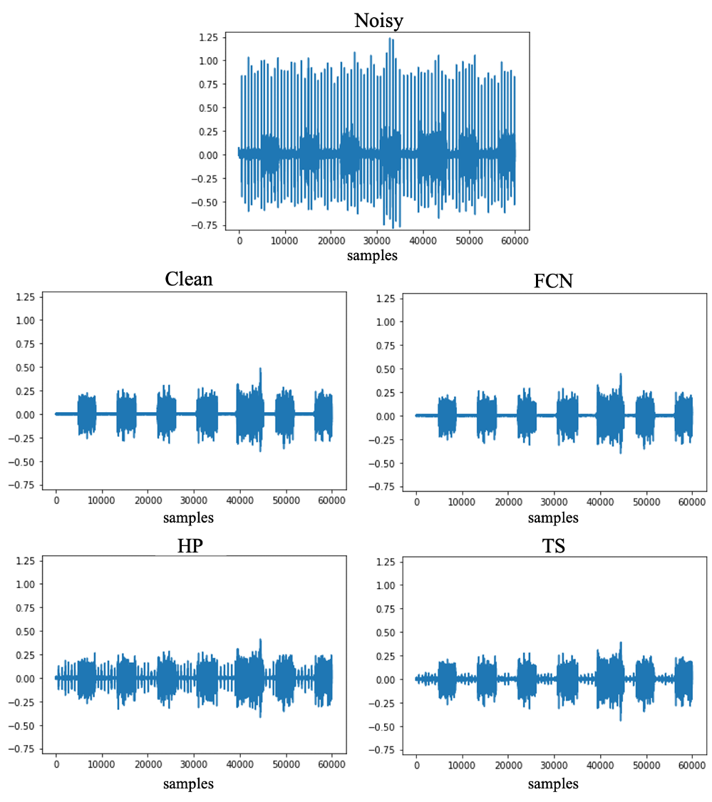

# ECG removal from sEMG by FCN
Electrocardiogram (ECG) artifact contamination often occurs in surface electromyography (sEMG) applications when the measured muscles proximate the heart. Previous studies have developed various methods to tackle this problem, such as high-pass filter, template subtraction and so forth. However, these methods still have some limitations and challenges, such as the requirement of reference signals and distortion in the original sEMG signals. This work proposed a novel denoise method to remove ECG artifacts from the single-channel sEMG signals using fully convolution networks (FCN). The proposed method adopted a denoise autoencoder structure and the powerful nonlinear mapping capability of neural networks for sEMG denoising. We compared the proposed approach with conventional approaches, including high-pass filters and template subtraction, on open datasets called Non-Invasive Adaptive Prosthetics sEMG database and MIT-BIH Normal Sinus Rhythm Database. The experimental results show that FCN outperformed conventional methods in sEMG reconstruction quality under a wide range of SNR input.

# Environment
This project is built on Python 3.6. You may run the following command to install all the packages listed in the requirements.txt:
    
    pip3 install -r requirements.txt

# Database

Please download the database on these websites first:
1. ECG: [MIT-BIH Normal Sinus Rhythm Database](https://www.physionet.org/content/nsrdb/1.0.0/) 
2. sEMG: [NINAPro database DB2](http://ninaweb.hevs.ch/node/17)

# Preprocessing and generate the noisy dataset

To extract specific channels ECG and sEMG data from the downloaded database, please refer to the files 'clean_ecg.py' and 'clean_emg.py'.

To generate noisy sEMG dataset, please refer to 'mixture.py' and execute 'gen_pt_aug.py' by the following command:

    python gen_pt_aug.py 
    --noisy_path </path/to/noisy/data>
    --clean_path </path/to/clean/data> 
    --out_path </path/to/training/data> 
   
# Train models to remove ECG artifacts from sEMG 

Please execute the following command:

    python main.py 
    --mode train 
    --train_path </path/to/training/data> 
    --writer </path/to/logs> 
    --model <model_name> (e.g. FNC_01)

# Testing  

To test the performance of ECG removal methods (NN models / IIR filters / template subtraction), please execute the following command:

    python main.py 
    --mode test 
    --train_path </path/to/training/data> 
    --test_clean </path/to/testing/noisy/data> 
    --test_noisy </path/to/testing/clean/data> 
    --writer </path/to/logs> 
    --model <model_name> (e.g. FNC_01)
    --task: <method> (e.g. evaluate_HP/evaluate_FTSHP, default is the denoise NN models)
 
# Experimnetal Results

  
For more information, please refer to this paper.
